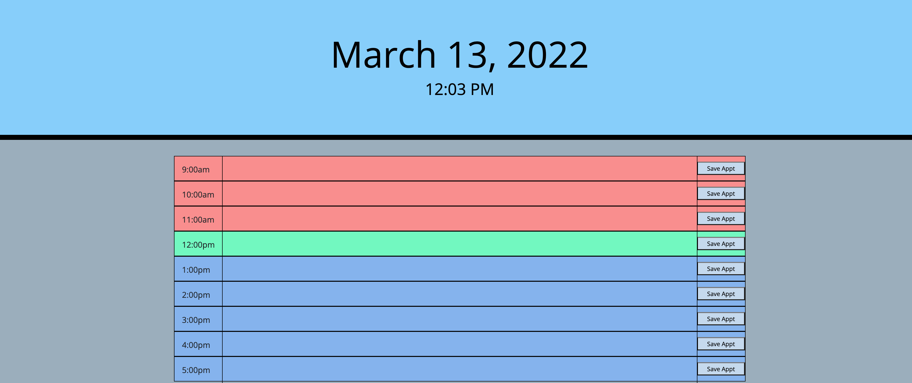
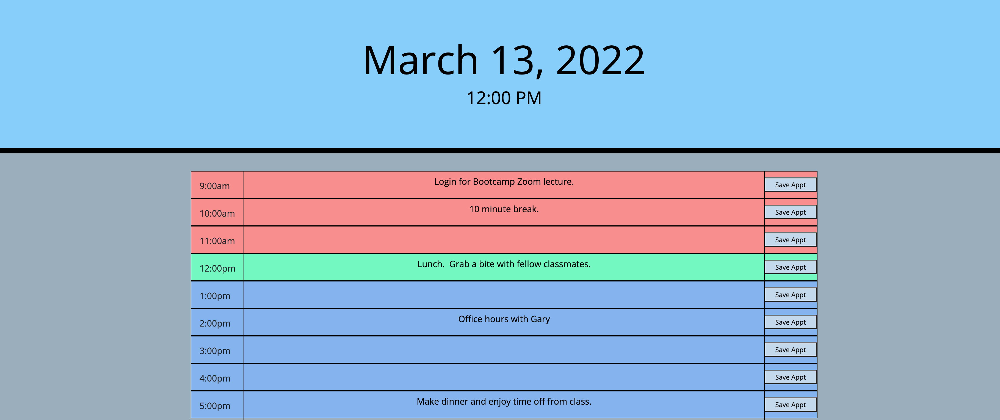
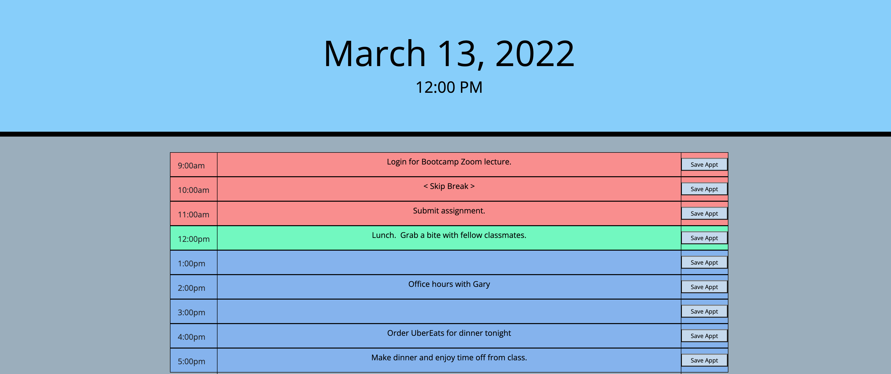

# Workday Scheduler

## Task

Create a simple calendar application that allows a user to save events for business hours of the day by modifying starter code. This app will run in the browser and feature dynamically updated HTML and CSS powered by jQuery.

## Objectives
```
- User will open Day planner by accessing URL / link
- Current Date and Time is displayed at top of page, by way of Moment.
- Scrolling down, there are color coded time-blocks (Past, Present, and Future)
- When user clicks on a time slot, they are able to enter / edit the event
- When user clicks the save button, the data is stored both within HTML and local storage
- When user reloads the page, the up-to-date data remains
- When user edits previous data, the new data is pushed to local and html storage
```
-----

## Final screenshots of initial, details entered, and details edited page







-----
## Links for Github Repository and final public page

- [Github Repository for Day Planner](https://github.com/ksjefferies/work-day-scheduler)

- [Day Planner final page](https://ksjefferies.github.io/work-day-scheduler/)

## Contributions and sources:

- [Moment Formatting](https://momentjscom.readthedocs.io/en/latest/moment/04-displaying/01-format/)
- [Bootstrap Grid System](https://www.w3schools.com/bootstrap/bootstrap_grid_system.asp)

I worked with the following people:
- Daniel Norred 
- Eugene
- Dev Wolf

## License
This code is licensed under the MIT License